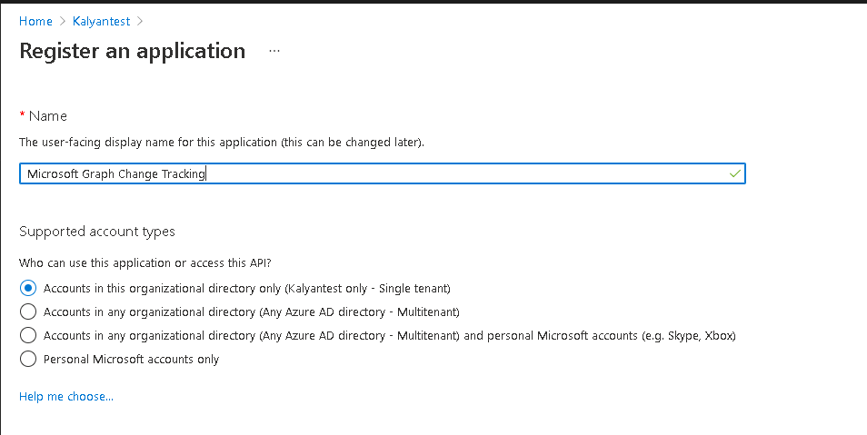
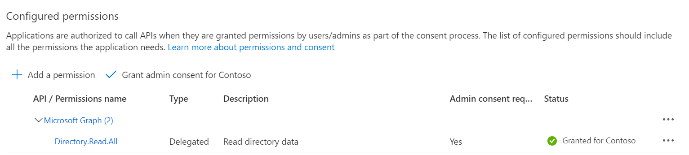

# Explore advanced Microsoft Graph Query Capabilities for Directory Objects (AAD) with .NET SDK

- [Overview](#overview)
- [Prerequisites](#prerequisites)
- [Registration](#registration)
  - [Step 1: Register your application](#step-1-register-your-application)
  - [Step 2: Set the MS Graph permissions](#step-2-set-the-ms-graph-permissions)
- [Setup](#setup)
  - [Step 1:  Clone or download this repository](#step-1--clone-or-download-this-repository)
  - [Step 2: Configure the ClientId using the Secret Manager](#step-2-configure-the-clientid-using-the-secret-manager)
- [Run the sample](#run-the-sample)
  - [On Visual Studio](#on-visual-studio)
  - [On Visual Studio Code](#on-visual-studio-code)
  - [Using the app](#using-the-app)
- [Code Architecture](#code-architecture)

## Overview

This sample helps you explore the Microsoft Graph's [new query capabilities](https://aka.ms/BlogPostMezzoGA) of the identity APIs using the [Microsoft Graph SDK](https://github.com/microsoftgraph/msgraph-sdk-dotnet) to query Azure AD.
The main code is in [GraphDataService.cs](MSGraphSamples.WPF/Services/GraphDataService.cs) file, where every request pass trough `AddAdvancedOptions` function adding the required `$count=true` QueryString parameter and `ConsistencyLevel=eventual` header.

## Prerequisites

- Either [Visual Studio (>v16.8)](https://aka.ms/vsdownload) *or* [Visual Studio Code](https://code.visualstudio.com/) with [.NET 5.0 SDK](https://dotnet.microsoft.com/download/dotnet/5.0) and [C# for Visual Studio Code Extension](https://marketplace.visualstudio.com/items?itemName=ms-dotnettools.csharp)
- An Azure Active Directory (Azure AD) tenant. For more information, see [How to get an Azure AD tenant](https://azure.microsoft.com/documentation/articles/active-directory-howto-tenant/)
- A user account in your Azure AD tenant. This sample will not work with a personal Microsoft account (formerly Windows Live account). Therefore, if you signed in to the [Azure portal](https://portal.azure.com) with a Microsoft account and have never created a user account in your directory before, you need to do that now.

## Registration

### Step 1: Register your application

Use the [Microsoft Application Registration Portal](https://aka.ms/appregistrations) to register your application with the Microsoft Graph APIs.


**Note:** Make sure to set the right **Redirect URI** (`http://localhost`) and application type is **Mobile and desktop applications**.

### Step 2: Set the MS Graph permissions

Add the [delegated permissions](https://docs.microsoft.com/graph/permissions-reference#delegated-permissions-20) for `Directory.Read.All`. We advise you to register and use this sample on a Dev/Test tenant and not on your production tenant.



## Setup

### Step 1:  Clone or download this repository

From your shell or command line:

```Shell
git clone https://github.com/microsoftgraph/dotnet-aad-query-sample.git
```

or download and extract the repository .zip file.

### Step 2: Configure the ClientId using the Secret Manager

This application use the [.NET Core Secret Manager](https://docs.microsoft.com/aspnet/core/security/app-secrets) to store the **ClientId**. To add the **ClientId** created on step 1 of registration:

1. Open a **Developer Command Prompt** or an **Integrated Terminal** and locate the `dotnet-aad-query-sample\MSGraphSamples.WPF\` directory.
1. Type `dotnet user-secrets set "clientId" "<YOUR CLIENT ID>"`

## Run the sample

### On Visual Studio

Press F5. This will restore the missing nuget packages, build the solution and run the project.

### On Visual Studio Code

Shortly after you open the project folder in VS Code, a prompt by C# extension will appear on bottom right corner:  
`Required assets to build and debug are missing from 'dotnet-aad-query-sample'. Add them?`.  
Select **Yes** and a `.vscode` folder will be created in the project root folder.

Once this is done, open an integrated terminal in VS Code, then type:

```console
    cd MSGraphSamples.WPF
    dotnet build
    dotnet run
```

### Using the app

If everything was configured correctly, you should be able to see the first login prompt. The auth token will be cached thanks to [MSAL token cache extension](https://github.com/AzureAD/microsoft-authentication-extensions-for-dotnet) for the subsequent runs.  
You can query your tenant by typing the arguments of the standard OData `$select`, `$filter`, `$orderBy`, `$search` clauses in the relative text boxes. In the screenshot below you can see the $search operator in action:


- If you double click on a row, a default drill-down will happen (for example by showing the list of transitive groups a user is part of).
- If you click on a header, the results will be sorted by that column. **Note: not all columns are supported and you may receive an error**.
- If any query error happen, it will displayed with a Message box.

The generated URL will appear in the readonly Url textbox. You can click the Graph Explorer button to open the current query in Graph Explorer.

## Code Architecture

This app provides a good starting point for enterprise desktop applications that connects to Microsoft Graph.  
The implementation is a classic **WPF** [MVVM](https://docs.microsoft.com/en-us/windows/uwp/data-binding/data-binding-and-mvvm) app with *Views*, *ViewModels* and *Services*, using [MVVM Toolkit framework](https://github.com/windows-toolkit/MVVM-Samples).  
Dependency Injection is implemented using [Microsoft.Extensions.DependencyInjection](https://docs.microsoft.com/aspnet/core/fundamentals/dependency-injection), supporting design-time data.  
**Nullable** and **Code Analysis** are enabled to enforce code quality.
