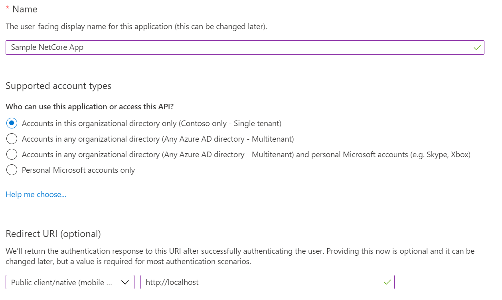

# Microsoft Graph change notifications delivered via Azure Event Hubs

- [Microsoft Graph change notifications delivered via Azure Event Hubs](#microsoft-graph-change-notifications-delivered-via-azure-event-hubs)
  - [Overview](#overview)
  - [Prerequisites](#prerequisites)
  - [Registration](#registration)
    - [Step 1: Register your application](#step-1-register-your-application)
    - [Step 2: Set the MS Graph permissions](#step-2-set-the-ms-graph-permissions)
  - [Using Azure Event Hubs to receive change notifications](#using-azure-event-hubs-to-receive-change-notifications)
    - [Set up the Azure KeyVault and Azure Event Hubs](#set-up-the-azure-keyvault-and-azure-event-hubs)
      - [Option 1: Using the Azure CLI](#option-1-using-the-azure-cli)
      - [Option 2: Using the Azure Portal](#option-2-using-the-azure-portal)
        - [Configuring the Azure Event Hub](#configuring-the-azure-event-hub)
        - [Configuring the Azure Key Vault](#configuring-the-azure-key-vault)
        - [Configuring the Azure Storage Account](#configuring-the-azure-storage-account)
    - [Creating the subscription and receiving notifications](#creating-the-subscription-and-receiving-notifications)
  - [Setup](#setup)
    - [Step 1:  Clone or download this repository](#step-1--clone-or-download-this-repository)
  - [Configure the sample](#configure-the-sample)
  - [Run the sample](#run-the-sample)
    - [On Visual Studio](#on-visual-studio)
    - [Using the app](#using-the-app)
  - [About the Code](#about-the-code)

## Overview

This sample helps you explore the Microsoft Graph's [change notification delivery via Azure Event Hubs](https://docs.microsoft.com/graph/change-notifications-delivery).

Change notifications can be delivered in different ways to subscribers. If the main delivery mode for change notifications is through webhooks, it can be challenging to take advantage of webhooks for high throughput scenarios or when the receiver cannot expose a publicly available notification URL.  

Receiving change notifications via Azure Event Hubs as the delivery mode is available for all resources that support Microsoft Graph change notifications.

Good examples of high throughput scenarios include applications subscribing to a large set of resources, applications subscribing to resources that change with a high frequency, and multi-tenant applications that subscribe to resources across a large set of organizations.

## Prerequisites

- Either [Visual Studio](https://aka.ms/vsdownload) *or* [Visual Studio Code](https://code.visualstudio.com/) with [.NET 5.0 SDK](https://dotnet.microsoft.com/download/dotnet/5.0) and [C# for Visual Studio Code Extension](https://marketplace.visualstudio.com/items?itemName=ms-dotnettools.csharp)
- An Azure Active Directory (Azure AD) tenant. For more information, see [How to get an Azure AD tenant](https://azure.microsoft.com/documentation/articles/active-directory-howto-tenant/)
- [An Azure subscription](https://azure.microsoft.com/free/).
- A user account in your Azure AD tenant. This sample will not work with a personal Microsoft account (formerly Windows Live account). Therefore, if you signed in to the [Azure portal](https://portal.azure.com) with a Microsoft account and have never created a user account in your directory before, you need to do that now.

## Registration

### Step 1: Register your application

Use the [Microsoft Application Registration Portal](https://aka.ms/appregistrations) to register your application with the Microsoft Microsoft Identity Platform. This sample assumes that you have named your app **Microsoft Graph Change Tracking**.


**Note:** Make sure to set the right **Redirect URI** (`http://localhost`) and application type is **Mobile and desktop applications**.

### Step 2: Set the MS Graph permissions

Add the [delegated permissions](https://docs.microsoft.com/graph/permissions-reference#delegated-permissions-20) for `Directory.Read.All`. We advise you to register and use this sample on a Dev/Test tenant and not on your production tenant.


## Using Azure Event Hubs to receive change notifications

[Azure Event Hubs](https://azure.microsoft.com/services/event-hubs) is a popular real-time events ingestion and distribution service built for scale. You can use Azure Events Hubs instead of traditional webhooks to receive change notifications. This feature is currently in preview.  
Using Azure Event Hubs to receive change notifications differs from webhooks in a few ways, including:

- You don't rely on publicly exposed notification URLs. The Event Hubs SDK will relay the notifications to your application.
- You don't need to reply to the [notification URL validation](webhooks.md#notification-endpoint-validation). You can ignore the validation message that you receive.
- You'll need to provision an Azure Event Hub.
- You'll need to provision an Azure Key Vault.

### Set up the Azure KeyVault and Azure Event Hubs

This section will walk you through the setup of required Azure services.

#### Option 1: Using the Azure CLI

The [Azure CLI](/cli/azure/what-is-azure-cli) allows you to script and automate administrative tasks in Azure. The CLI can be [installed on your local computer](/cli/azure/install-azure-cli) or run directly from the [Azure Cloud Shell](/azure/cloud-shell/quickstart).

```azurecli
# --------------
# TODO: update the following values
#sets the name of the resource group
resourcegroup=rg-graphevents-dev
#sets the location of the resources
location='uk south'
#sets the name of the Azure Event Hubs namespace
evhamespacename=evh-graphevents-dev
#sets the name of the hub under the namespace
evhhubname=graphevents
#sets the name of the access policy to the hub
evhpolicyname=grapheventspolicy
#sets the name of the Azure KeyVault
keyvaultname=kv-graphevents
#sets the name of the secret in Azure KeyVault that will contain the connection string to the hub
keyvaultsecretname=grapheventsconnectionstring
# --------------
az group create --location $location --name $resourcegroup
az eventhubs namespace create --name $evhamespacename --resource-group $resourcegroup --sku Basic --location $location
az eventhubs eventhub create --name $evhhubname --namespace-name $evhamespacename --resource-group $resourcegroup --partition-count 2 --message-retention 1
az eventhubs eventhub authorization-rule create --name $evhpolicyname --eventhub-name $evhhubname --namespace-name $evhamespacename --resource-group $resourcegroup --rights Send
evhprimaryconnectionstring=`az eventhubs eventhub authorization-rule keys list --name $evhpolicyname --eventhub-name $evhhubname --namespace-name $evhamespacename --resource-group $resourcegroup --query "primaryConnectionString" --output tsv`
az keyvault create --name $keyvaultname --resource-group $resourcegroup --location $location --enable-soft-delete true --sku standard --retention-days 90
az keyvault secret set --name $keyvaultsecretname --value $evhprimaryconnectionstring --vault-name $keyvaultname --output none
graphspn=`az ad sp list --display-name 'Microsoft Graph Change Tracking' --query "[].appId" --output tsv`
az keyvault set-policy --name $keyvaultname --resource-group $resourcegroup --secret-permissions get --spn $graphspn --output none
keyvaulturi=`az keyvault show --name $keyvaultname --resource-group $resourcegroup --query "properties.vaultUri" --output tsv`
domainname=`az ad signed-in-user show --query 'userPrincipalName' | cut -d '@' -f 2 | sed 's/\"//'`
notificationUrl="EventHub:${keyvaulturi}secrets/${keyvaultsecretname}?tenantId=${domainname}"
echo "Notification Url:\n${notificationUrl}"
```

> **Note:** The script provided here is compatible with Linux based shells, Windows WSL, and Azure Cloud Shell. It will require some updates to run in Windows shells.

#### Option 2: Using the Azure Portal

##### Configuring the Azure Event Hub

In this section you will:

- Create an Azure Event Hub namespace.
- Add a hub to that namespace that will relay and deliver notifications.
- Add a shared access policy that will allow you to get a connection string to the newly created hub.

Steps:

1. Open a browser to the [Azure Portal](https://portal.azure.com).
1. Select **Create a resource**.
1. Type **Event Hubs** in the search bar.
1. Select the **Event Hubs** suggestion. The Event Hubs creation page will load.  
1. On the Event Hubs creation page, click **Create**.
1. Fill in the Event Hubs namespace creation details, and then click **Create**.  
1. When the Event Hub namespace is provisioned, go to the page for the namespace.  
1. Click **Event Hubs** and **+ Event Hub**.  
1. Give a name to the new Event Hub, and click **Create**.  
1. After the Event Hub has been created, click the name of the Event Hub, and then click **Shared access policies** and **+ Add** to add a new policy.  
1. Give a name to the policy, check **Send**, and click **Create**.  
1. After the policy has been created, click the name of the policy to open the details panel, and then copy the **Connection string-primary key** value. Write it down; you'll need it for the next step.  

##### Configuring the Azure Key Vault

In order to access the Event Hub securely and to allow for key rotations, Microsoft Graph gets the connection string to the Event Hub through Azure Key Vault.  
In this section, you will:

- Create an Azure Key Vault to store secret.
- Add the connection string to the Event Hub as a secret.
- Add an access policy for Microsoft Graph to access the secret.

Steps:

1. Open a browser to the [Azure Portal](https://portal.azure.com).
1. Select **Create a resource**.
1. Type **Key Vault** in the search bar.
1. Select the **Key Vault** suggestion. The Key Vault creation page will load.
1. On the Key Vault creation page, click **Create**.  
1. Fill in the Key Vault creation details, and then click **Review + Create** and **Create**.  
1. Go to the newly crated key vault using the **Go to resource** from the notification.  
1. Copy the **Vault URI**; you will need it for the next step.  
1. Go to **Secrets** and click **+ Generate/Import**.  
1. Give a name to the secret, and keep the name for later; you will need it for the next step. For the value, paste in the connection string you generated at the Event Hubs step. Click **Create**.  
1. Click **Access Policies** and **+ Add Access Policy**.  
1. For **Secret permissions**, select **Get**, and for **Select Principal**, select **Microsoft Graph Change Tracking**. Click **Add**.  

##### Configuring the Azure Storage Account
[TODO]

### Creating the subscription and receiving notifications

After you create the required Azure KeyVault and Azure Event Hubs services, you will be able to create your subscription and start receiving change notifications via Azure Event Hubs.

## Setup

### Step 1:  Clone or download this repository

From your shell or command line:

```Shell
git clone https://github.com/microsoftgraph/msgraph-training-changenotifications.git
cd demos\04-azure-eventhub-listener
```

or download and extract the repository .zip file.

## Configure the sample

In the `appSettings` section, populate the following keys

- EventHubConnectionString
- EventHubName
- StorageAccountName
- StorageAccountKey
  
## Run the sample

### On Visual Studio

Press F5. This will restore the missing nuget packages, build the solution and run the project.

### Using the app

If everything was configured correctly, you should be able to see the first login prompt. The auth token will be cached thanks to [MSAL token cache extension](https://github.com/AzureAD/microsoft-authentication-extensions-for-dotnet) for the subsequent runs.  
You can query your tenant by typing the arguments of the standard OData `$select`, `$filter`, `$orderBy`, `$search` clauses in the relative text boxes. In the screenshot below you can see the $search operator in action:


- If you double click on a row, a default drill-down will happen (for example by showing the list of transitive groups a user is part of).
- If you click on a header, the results will be sorted by that column. **Note: not all columns are supported and you may receive an error**.
- If any query error happen, it will displayed with a Message box.

The generated URL will appear in the readonly Url textbox. You can click the Graph Explorer button to open the current query in Graph Explorer.

## About the Code
[TODO]


