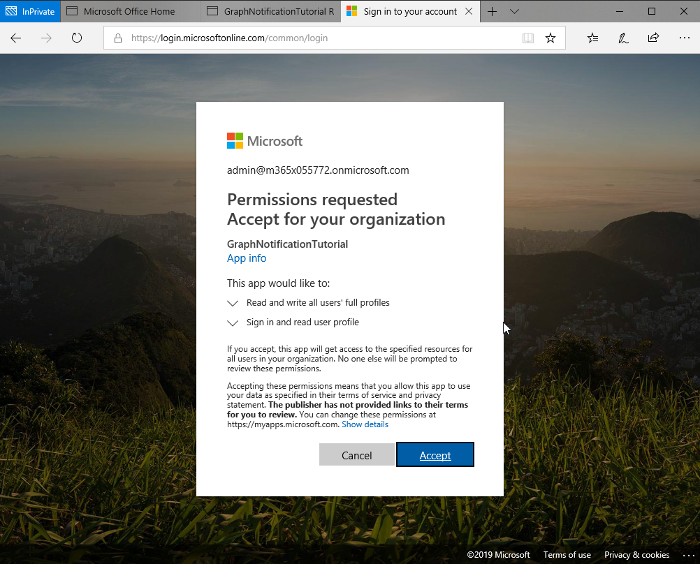
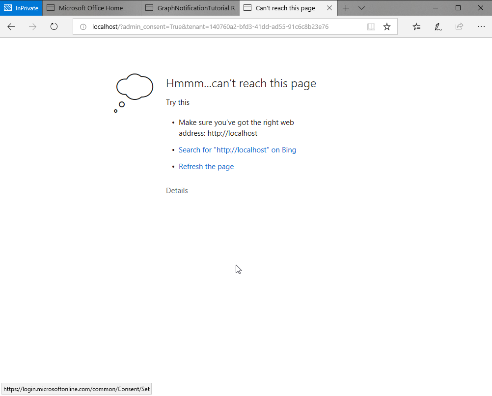

<!-- markdownlint-disable MD002 MD041 -->

### Register and grant consent to the application in Microsoft Graph

1. Open a browser and navigate to the [Azure Active Directory admin center](https://portal.azure.com). Login using a **Work or School Account**.

1. Select **Azure Active Directory** in the left-hand navigation, then select **App registrations (Preview)** under **Manage**.

    

1. Select **New registration**. On the **Register an application** page, set the values as follows.

    - Set **Name** to `GraphNotificationTutorial`.
    - Set **Supported account types** to **Accounts in any organizational directory and personal Microsoft accounts**.
    - Under **Redirect URI**, set the first drop-down to `Web` and set the value to `http://localhost`.

    

1. Select **Register**. On the **GraphNotificationTutorial** page, copy the value of the **Application (client) ID** and save it, you will need it in the next step.

    

1. Select **Certificates & secrets** under **Manage**. Select **New client secret**. Enter a value in **Description** and select one of the options for **Expires** and select **Add**.

    

1. Copy the client secret value before you leave this page. You will need it in the next step.

    > [!IMPORTANT]
    > This client secret is never shown again, so make sure you copy it now.

    

1. Select **API Permissions** under **Manage**. **Add a permission** and select **Microsoft Graph**. Select **Application Permission** and expand **User** and select the **User.ReadWrite.All** scope. Select **Add permissions** to save your changes.

    

The application requests an application permission with the User.ReadWrite.All scope. This permission requires administrative consent.

Copy the following URL and replace the `{clientId}` placeholder with your application's Application Id from the application registration portal.

```html
https://login.microsoftonline.com/common/adminconsent?client_id={clientId}&redirect_uri=http://localhost
```

Paste the URL into a browser. You are prompted to sign in. You must sign in as a user with administrator privileges in order to consent this application.


After signing in, you are prompted to consent to the permission requests to read and write all users' full profiles and to sign in and read the current user's profile. Select **Accept**.



> **Note:** There can be an approximately a 20 minute data replication delay between the time when an application is granted admin consent and when API calls can be made using the application.

After accepting you will redirected to your localhost and will likely see an error page. That is ok. In a production application you would redirect the user to your applications web page.


