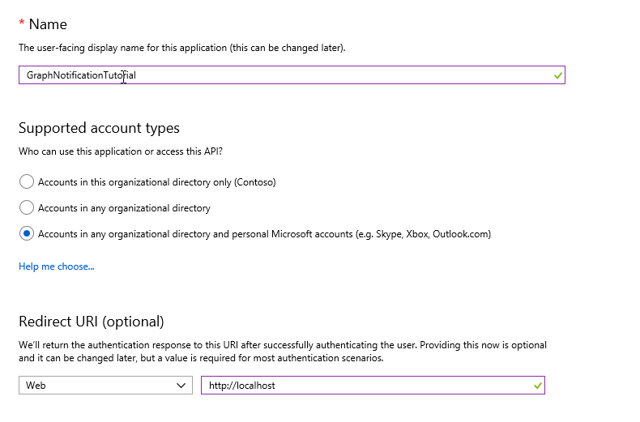
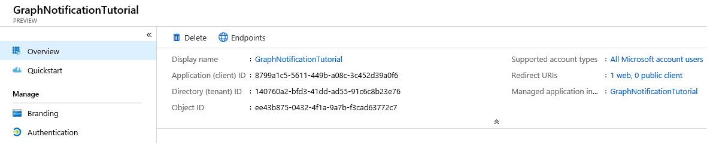
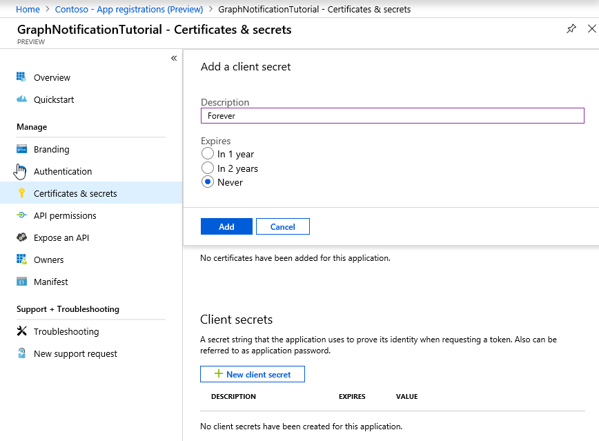
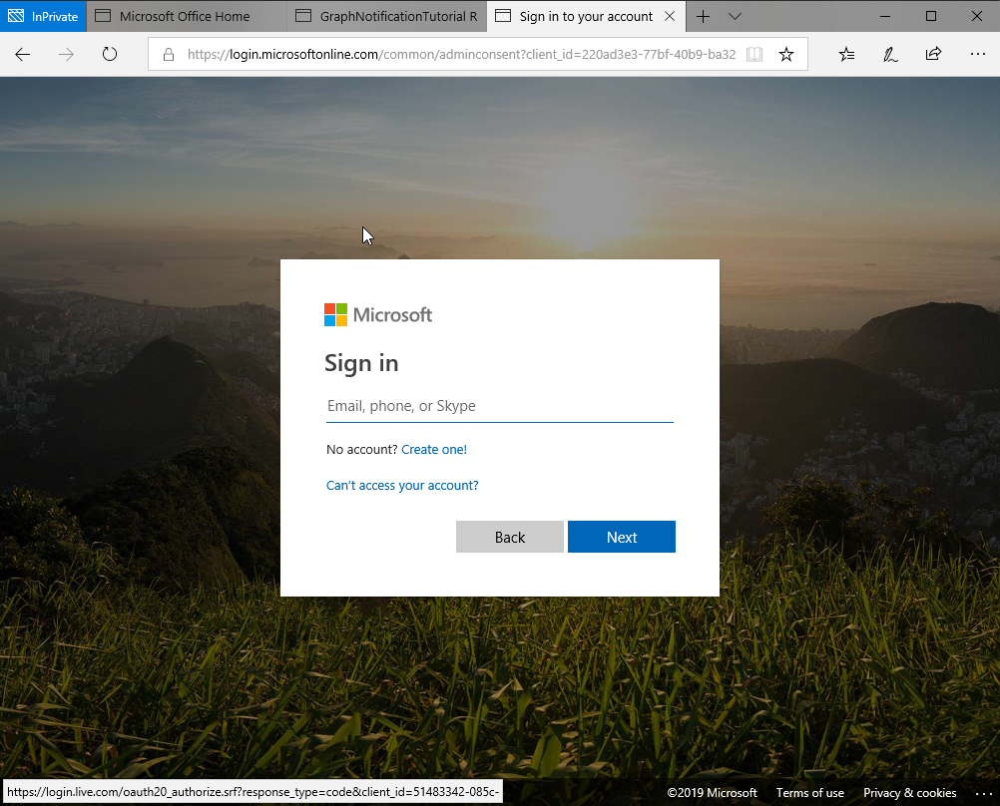

<!-- markdownlint-disable MD002 MD041 -->

In this exercise, you will create a new Azure AD web application registration using the Azure Active Directory admin center and grant administrator consent to the required permission scopes.

1. Open a browser and navigate to the [Azure Active Directory admin center](https://portal.azure.com). Login using a **Work or School Account**.

1. Select **Azure Active Directory** in the left-hand navigation, then select **App registrations (Preview)** under **Manage**.

    

1. Select **New registration**. On the **Register an application** page, set the values as follows.

    - Set **Name** to `GraphNotificationTutorial`.
    - Set **Supported account types** to **Accounts in any organizational directory and personal Microsoft accounts**.
    - Under **Redirect URI**, set the first drop-down to `Web` and set the value to `http://localhost`.

    

1. Select **Register**. On the **GraphNotificationTutorial** page, copy the value of the **Application (client) ID** and **Directory (tenant) ID** save it, you will need them in the next step.

    

1. Select **Certificates & secrets** under **Manage**. Select **New client secret**. Enter a value in **Description** and select one of the options for **Expires** and select **Add**.

    

1. Copy the client secret value before you leave this page. You will need it in the next step.

    > [!IMPORTANT]
    > This client secret is never shown again, so make sure you copy it now.

    

1. Select **API Permissions** under **Manage**. **Add a permission** and select **Microsoft Graph**. Select **Application Permission** and expand **User** and select the **User.ReadWrite.All** scope. Select **Add permissions** to save your changes.

    

The application requests an application permission with the **User.ReadWrite.All** scope. This permission requires administrative consent.

Select **Grant admin consent for Contoso** and then select **Yes** to consent this application and grant the application access to your tenant using the scopes you specified.

