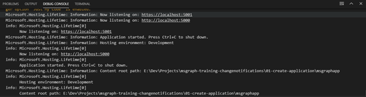
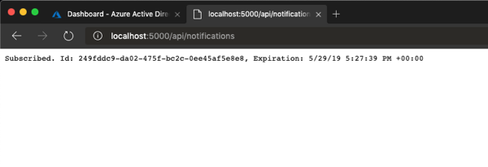
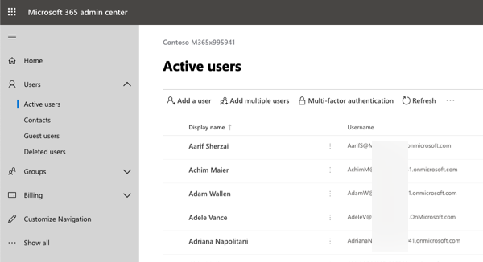

<!-- markdownlint-disable MD002 MD041 -->

Update the Visual Studio debugger launch configuration:

> [!NOTE]
> By default, the .NET Core launch configuration will open a browser and navigate to the default URL for the application when launching the debugger. For this application, we instead want to navigate to the NGrok URL. If you leave the launch configuration as is, each time you debug the application it will display a broken page. You can just change the URL, or change the launch configuration to not launch the browser:

  1. In Visual Studio Code, open the file **.vscode/launch.json**.
  1. Delete the following section in the default configuration:

      ```json
      // Enable launching a web browser when ASP.NET Core starts. For more information: https://aka.ms/VSCode-CS-LaunchJson-WebBrowser
      "serverReadyAction": {
          "action": "openExternally",
          "pattern": "^\\s*Now listening on:\\s+(https?://\\S+)"                
      },
      ```

  1. Save your changes.

### Test the application:

In Visual Studio Code, select **Debug > Start debugging** to run the application. VS Code will build and start the application.

Once you see the following in the **Debug Console** window...



... open a browser and navigate to **http://localhost:5000/api/notifications** to subscribe to change notifications. If successful you will see output that includes a subscription id like the one below:



Your application is now subscribed to receive notifications from the Microsoft Graph when an update is made on any user in the Office 365 tenant.

Trigger a notification:

1. Open a browser and navigate to the [Microsoft 365 admin center (https://admin.microsoft.com/AdminPortal)](https://admin.microsoft.com/AdminPortal).
1. If prompted to login, sign-in using an admin account.
1. Select **Users > Active users**.

    

1. Select an active user and select **Edit** for their **Contact information**.

    

1. Update the **Phone number** value with a new number and Select **Save**.

    In the Visual Studio Code **Debug Console**, you will see a notification has been received. Sometimes this may take a few minutes to arrive. An example of the output is below:

    ```shell
    Received notification: 'Users/7a7fded6-0269-42c2-a0be-512d58da4463', 7a7fded6-0269-42c2-a0be-512d58da4463
    ```

This indicates the application successfully received the notification from the Microsoft Graph for the user specified in the output. You can then use this information to query the Microsoft Graph for the users full details if you want to synchronize their details into your application.