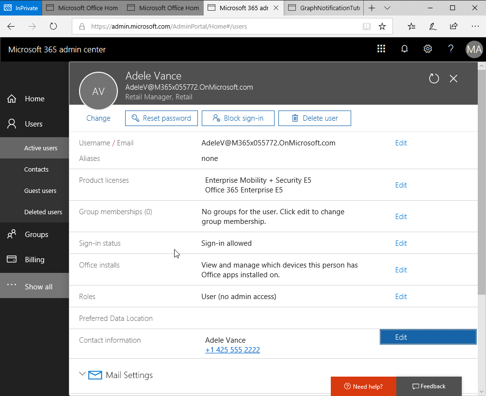

<!-- markdownlint-disable MD002 MD041 -->

### Query for changes

Microsoft Graph offers the ability to query for changes to a particular resource since you last called it. Using this combined with Change Notifications is a robust method for ensuring you dont miss any changes to the resources.

Open **NotificationsController.cs** and replace the `Post` method with the following code:

```csharp
public ActionResult<string> Post([FromQuery]string validationToken = null)
{
  // handle validation
  if(!string.IsNullOrEmpty(validationToken))
  {
    Console.WriteLine($"Received Token: '{validationToken}'");
    return Ok(validationToken);
  }

  // handle notifications
  using (StreamReader reader = new StreamReader(Request.Body))
  {
    string content = reader.ReadToEnd();

    Console.WriteLine(content);

    var notifications = JsonConvert.DeserializeObject<Notifications>(content);

    foreach(var notification in notifications.Items)
    {
      Console.WriteLine($"Received notification: '{notification.Resource}', {notification.ResourceData?.Id}");
    }
  }

  // use deltaquery to query for all updates
  CheckForUpdates();

  return Ok();
}
```

The `Post` method will now call `CheckForUpdates` when a notification is received. Below the `Post` method add the following two new methods: 

```csharp
private static string DeltaLink = null;

private void CheckForUpdates()
{
  var uri = "";

  // get an access token from graph
  var accessToken = GetAccessToken();

  if(string.IsNullOrEmpty(DeltaLink))
  {
    uri = "https://graph.microsoft.com/v1.0/users/delta";
  }
  else
  {
    uri = DeltaLink;
  }

  Console.WriteLine($"Getting users: {uri}");

  while (true)
  {
    var users = GetChangedUsers(uri, accessToken);

    foreach(var user in users.Users)
    {
      Console.WriteLine($"User: {user.Id}, {user.GivenName} {user.Surname} Removed?:{user.Removed?.Reason}");
    }

    if(!string.IsNullOrEmpty(users.NextLink))
    {
      Console.WriteLine($"Got nextlink");
      uri = users.NextLink;
    }
    else
    {
      DeltaLink = users.DeltaLink;
      Console.WriteLine($"Got deltalink");
      break;
    }
  }
}

private UsersResponse GetChangedUsers(string uri, string accessToken)
{
  using (var client = new HttpClient())
  {
    client.DefaultRequestHeaders.Add("Authorization", $"bearer {accessToken}");

    var result = client.GetAsync(uri).Result;
    string response = result.Content.ReadAsStringAsync().Result;

    var users = JsonConvert.DeserializeObject<UsersResponse>(response);

    return users;
  }
}
```

The `CheckForUpdates` method calls the graph using the delta url and then pages through the results until it finds a new `deltalink` on the final page of results. It stores the url in memory until the code is notified again when another notification is triggered.

**Right-click** the **Models** folder and add a new file **UsersResponse.cs**

Add the following code to the file.

```csharp
// Copyright (c) Microsoft. All rights reserved. Licensed under the MIT license. See LICENSE in the project root for license information.
using Newtonsoft.Json;
using System;

namespace msgraphapp.Models
{
  // A change notification.
  public class UsersResponse
  {
    // The type of change.
    [JsonProperty(PropertyName = "value")]
    public User[] Users { get; set; }

    [JsonProperty(PropertyName = "@odata.context")]
    public string Context { get; set; }

    [JsonProperty(PropertyName = "@odata.deltaLink")]
    public string DeltaLink { get; set; }

    [JsonProperty(PropertyName = "@odata.nextLink")]
    public string NextLink { get; set; }

  }

  public class User
  {
    [JsonProperty(PropertyName = "displayName")]
    public string DisplayName { get; set; }

    [JsonProperty(PropertyName = "givenName")]
    public string GivenName { get; set; }

    [JsonProperty(PropertyName = "surname")]
    public string Surname { get; set; }

    [JsonProperty(PropertyName = "id")]
    public string Id { get; set; }

    [JsonProperty(PropertyName = "@removed")]
    public Change Removed { get; set; }
  }

  public class Change 
  {
    [JsonProperty(PropertyName = "reason")]
    public string Reason { get; set; }
  }
}
```

**Save** all files.

Select **Debug > Start debugging** to run the application. After building the application a browser window will open to a 404 page. This is ok since our application is an API and not a webpage.

To subscribe for change notifications for users navigate to the following url **http://localhost:5000/api/notifications**.

Open a browser and visit **https://admin.microsoft.com/AdminPortal**. Sign-in using an administrator account. Select **Users > Active users**. Select an active user and select **Edit** for their **Contact information**. Update the **Mobile phone** value with a new number and Select **Save**. 



Wait for the notification to be received as indicated in the **DEBUG CONSOLE** as follows:

```shell
Received notification: 'Users/7a7fded6-0269-42c2-a0be-512d58da4463', 7a7fded6-0269-42c2-a0be-512d58da4463
```

The application will now initiate a delta query with the graph to get all the users and log out some of their details to the console output. 

```shell
Got access token
Getting users: https://graph.microsoft.com/v1.0/users/delta
User: 19e429d2-541a-4e0b-9873-6dff9f48fabe, Allan Deyoung Removed?:
User: 05501e79-f527-4913-aabf-e535646d7ffa, Christie Cline Removed?:
User: fecac4be-76e7-48ec-99df-df745854aa9c, Debra Berger Removed?:
User: 4095c5c4-b960-43b9-ba53-ef806d169f3e, Diego Siciliani Removed?:
User: b1246157-482f-420c-992c-fc26cbff74a5, Emily Braun Removed?:
User: c2b510b7-1f76-4f75-a9c1-b3176b68d7ca, Enrico Cattaneo Removed?:
User: 6ec9bd4b-fc6a-4653-a291-70d3809f2610, Grady Archie Removed?:
User: b6924afe-cb7f-45a3-a904-c9d5d56e06ea, Henrietta Mueller Removed?:
User: 0ee8d076-4f13-4e1a-a961-eac2b29c0ef6, Irvin Sayers Removed?:
User: 31f66f05-ac9b-4723-9b5d-8f381f5a6e25, Isaiah Langer Removed?:
User: 7ee95e20-247d-43ef-b368-d19d96550c81, Johanna Lorenz Removed?:
User: b2fa93ac-19a0-499b-b1b6-afa76c44a301, Joni Sherman Removed?:
User: 01db13c5-74fc-470a-8e45-d6d736f8a35b, Jordan Miller Removed?:
User: fb0b8363-4126-4c34-8185-c998ff697a60, Lee Gu Removed?:
User: ee75e249-a4c1-487b-a03a-5a170c2aa33f, Lidia Holloway Removed?:
User: 5449bd61-cc63-40b9-b0a8-e83720eeefba, Lynne Robbins Removed?:
User: 7ce295c3-25fa-4d79-8122-9a87d15e2438, Miriam Graham Removed?:
User: 737fe0a7-0b67-47dc-b7a6-9cfc07870705, Nestor Wilke Removed?:
User: a1572b58-35cd-41a0-804a-732bd978df3e, Patti Fernandez Removed?:
User: 7275e1c4-5698-446c-8d1d-fa8b0503c78a, Pradeep Gupta Removed?:
User: 96ab25eb-6b69-4481-9d28-7b01cf367170, Megan Bowen Removed?:
User: 846327fa-e6d6-4a82-89ad-5fd313bff0cc, Alex Wilber Removed?:
User: 200e4c7a-b778-436c-8690-7a6398e5fe6e, MOD Administrator Removed?:
User: 7a7fded6-0269-42c2-a0be-512d58da4463, Adele Vance Removed?:
User: 752f0102-90f2-4b8d-ae98-79dee995e35e,   Removed?:deleted
User: 4887248a-6b48-4ba5-bdd5-fed89d8ea6a0,   Removed?:deleted
User: e538b2d5-6481-4a90-a20a-21ad55ce4c1d,   Removed?:deleted
User: bc5994d9-4404-4a14-8fb0-46b8dccca0ad,   Removed?:deleted
User: d4e3a3e0-72e9-41a6-9538-c23e10a16122,   Removed?:deleted
Got deltalink
```

In the user management portal edit the user again and **Save** again using a different mobile phone number. 

The application will receive another notification and will query the graph again using the last delta link it received. However, this time you will notice that only the modified user was returned in the results. 

```shell
Getting users: https://graph.microsoft.com/v1.0/users/delta?$deltatoken=moXwmvoHW4B2uevGNLf2Brpv8smiFdOLsp
User: 7a7fded6-0269-42c2-a0be-512d58da4463, Adele Vance Removed?:
Got deltalink
```

Using this combination of notifications with delta query you can be assured you wont miss any updates to a resource. Notifications may be missed due to transient connection issues, however the next time your application gets a notification it will pick up all the changes since the last successful query.
